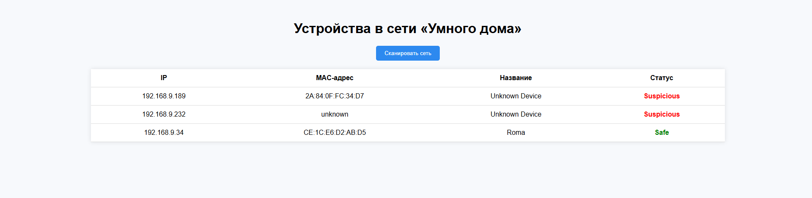

## Название проекта: защита IoT-устройства. Исследование и разработка прототипа безопасности системы для "умного дома".

## Цель проекта: Разработка и реализация прототипа срстемы, способной;
- автоматически сканировать локальную сеть умного дома;
- выявлять подключенные IoT - устройства;
- классифицировать устройство как безопасное или подозрительное;
- отображать результаты пользователю через простой интерфейс.

1. Иследовать типичные угрозы от IoT-устройства.
2. Разработать модуль сетевого сканирования.
3. Реализовать базу данных для хранения информации об устройствах.
4. Настройить систему классификации устройства.
5. Создать веб-интерфейс для отображения данных.
6. Провести тестирования прототипа.

## Технологии которые были использованны для разработки проекта:
- Python 3
- Nmap, python-nmap
- Flask
- SQLite
- HTML, CSS

## Архитектура проекта:

|     Пользователь    |
           ↓

|  Веб-интерфейс Flask|
| dashboard.html      |

           ↓

|         app.py             |
| Сканирование: scanner.py   |
| Анализ: security.py        |
| Хранение: database.py      |
           ↓
           
|      SQLite БД      |

## Пример интерфейса:

## Пример работы:

1. Пользователь открывает веб-страницу localhost:5000.
2. Нажимает "Сканировать сеть"
3. Система сканирует подсеть(можно изменть в scanner ==> subnet="192.168.9.0/24").
4. Все найденные устройства анализируются (MAC-адрес).
5. Результат сохраняется в БД.
6. Пользователь может просмотреть результаты в веб-интерфейсе.

## Анализ угроз и решений:

Угрозы;                                   Решения;
-----------------------------------------|-----------------------------------------
1. Подключение низвестного устройства.    1. Выделение как подозрительное
2. Отсутствие MAC в белом списке.         2. Классификация в "suspicious".
3. Изменение IP-адреса злоумышленником.   3. Использования MAC для контроля.
4. Отсутствие мониторинга.                4. Веб-итерфейс и журнал БД.

## Результаты тестирования:
- Проверено на сети с 3 устройствами.
- Устройство из белого списка классифицируется как safe.(Можно изменить классификацию в security.py)
- Остальные как suspicious.
- Результаты хранятся в БД.
- Список с неизвестными устройствами отправляются в телеграм

## Струкутура проекта:

IOT-security/
├── app.py
├── notifier.py
├── database.py
├── scanner.py
├── device.db
├── security.py
├── templates/dashboard.html
├── Documentation.md
└── README.md

## Используемые библиотеки храняться в requirements.txt.

Выводы: Система успешно реализует базовую защиту умного дома путем мониторинга сети классификации IOT устройств. Может быть расширена для:
- Добавления новых функций сканирования.
- Глубокой проверки портов.
- Интеграции с системой блокировки по MAC.

Проект бы создан Кирилл Белохвостов SW-46b.
Так же можно посмотреть на github: [https://github.com/Wh1tetail?tab=overview&from=2025-06-01&to=2025-06-12](https://github.com/Wh1tetail/IoT-secure)
